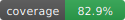

# Desafios Trilha Python DIO

 

## Desafio 1 – Sistema Bancário Simples (Depósito, Saque e Extrato)

Este repositório contém a implementação de um pequeno sistema bancário em Python proposto na trilha da **Digital Innovation One (DIO)**. O objetivo é praticar lógica de programação, uso de funções, validação de entrada e controle de estado em memória.

## 🧠 Visão Geral

O programa executa em modo interativo via terminal, exibindo um menu com operações:

```text
[d] Depositar
[s] Sacar
[e] Extrato
[q] Sair
```

Enquanto o usuário não escolhe `q`, o loop continua aceitando operações e atualizando o estado da conta.

## ✨ Funcionalidades

- Realizar depósitos (apenas valores positivos)
- Realizar saques com regras de negócio:
  - Máximo de 3 saques por execução (`LIMITE_SAQUES = 3`)
  - Limite de R$ 500,00 por saque (`limite = 500`)
  - Não permite sacar mais do que o saldo
- Exibir extrato consolidado de movimentações
- Mensagens de erro claras para operações inválidas

## 🗂️ Estrutura do Código

Toda a lógica está em `desafio-1.py`.

Principais variáveis globais:

- `saldo`: saldo atual da conta
- `limite`: limite máximo por saque (R$ 500)
- `extrato`: string acumulando transações
- `numero_saques`: contador de saques realizados
- `LIMITE_SAQUES`: constante que limita quantidade de saques (3)

Funções:

```python
def depositar_valor(saldo, extrato):
    # Lê valor, valida e atualiza saldo + extrato
    return saldo, extrato

def sacar_valor(saldo, limite, numero_saques, LIMITE_SAQUES, extrato):
    # Aplica todas as regras de saque e atualiza estado
    return saldo, extrato, numero_saques

def exibir_extrato(saldo, extrato):
    # Mostra todas as transações ou mensagem padrão
    return extrato
```

Cada função retorna os valores atualizados, que são reatribuídos no loop principal.

## ⚖️ Regras de Negócio

Depósito:

- Apenas valores maiores que zero.

Saque:

- Valor deve ser positivo.
- Não pode exceder o saldo disponível.
- Não pode exceder `limite` (R$ 500).
- Quantidade de saques limitada a `LIMITE_SAQUES` (3).

Extrato:

- Exibe cada linha formatada como `Depósito: R$ X` ou `Saque: R$ Y`.
- Caso não haja movimentações, mostra mensagem padrão.

## 🚀 Como Executar

Pré-requisito: Python 3.8+ (recomendado 3.11 ou superior).

Clone o repositório e execute:

```bash
python desafio-1.py
```

## 💻 Exemplo de Execução

```text
[d] Depositar
[s] Sacar
[e] Extrato
[q] Sair
=> d
Informe o valor do depósito: 100
=> s
Informe o valor do saque: 20
=> e
================ EXTRATO ================
Depósito: R$ 100.00
Saque: R$ 20.00

Saldo: R$ 80.00
==========================================
=> q
```

## 🧪 Teste Manual Rápido

Sugestões para validar comportamentos:

1. Tentar sacar sem saldo (espera mensagem de erro de saldo insuficiente).
2. Realizar 4 saques (o 4º deve falhar por exceder limite de quantidade).
3. Sacar valor maior que 500 (falha por exceder limite).
4. Depositar valor negativo (falha por valor inválido).

## 🔍 Considerações de Design

- Uso de funções puras em vez de classe para simplicidade pedagógica.
- Estado mantido em variáveis globais reatribuídas após cada operação.
- `extrato` como string acumulada evita estrutura mais complexa (lista ou objeto).

## 📦 Possíveis Melhorias Futuras

- Persistência em arquivo (JSON / CSV) ou banco de dados.
- Separar lógica em módulo (`bank.py`) e adicionar `main.py`.
- Criar classe `Conta` e encapsular regras.
- Adicionar testes unitários (ex.: `pytest`).
- Internacionalização (mensagens em múltiplos idiomas).
- Validar entradas com tratamento robusto (loop até valor válido).
- Suporte a múltiplas contas / usuários.
- Interface via `argparse` ou modo não interativo.

## 📊 Cobertura e Integração Contínua

Pipeline executa testes com cobertura de linhas e ramos (`--cov-branch`). Se disponível, a badge reflete cobertura de ramos; caso contrário, mostra cobertura de linhas. Falha se cobertura < 70% (`--cov-fail-under=70`).

Rodar localmente (linha + ramos):

```bash
pytest --cov=desafio-1 --cov-branch --cov-report=term --cov-fail-under=70 -q
```

Thresholds da badge (ramos ou linhas): 85/75/65/55/45.

Para elevar o padrão (ex.: 80%), ajuste a flag `--cov-fail-under` no workflow.

Observação: geração da badge não usa serviços externos.

## 🤝 Contribuição

Contribuições são bem-vindas! Abra uma issue ou envie um pull request descrevendo claramente a mudança proposta.

## 📄 Licença

Este projeto está licenciado sob a licença **MIT**. Veja o arquivo `LICENSE` para o texto completo.

Resumo rápido:

- Uso, cópia, modificação e distribuição permitidos.
- Inclua o aviso de copyright.
- Sem garantias: uso por sua conta e risco.

## 🧪 Testes Unitários (Roteiro Inicial)

Atualmente o projeto é totalmente interativo e o arquivo possui hífen no nome (`desafio-1.py`), o que dificulta importar as funções para testes. Recomenda-se criar uma versão modular para teste.

### Passo 1: Renomear ou extrair módulo

Opções:

1. Renomear `desafio-1.py` para `banco.py`.
2. Criar novo arquivo `banco.py` contendo apenas as funções (sem loop `while True`).

### Passo 2: Instalar dependências de teste

```bash
python -m pip install --upgrade pip
pip install pytest
```

Opcional: criar `requirements.txt` com `pytest`.

### Passo 3: Estrutura sugerida

```text
desafios-trilha-python-dio/
├── banco.py              # Funções isoladas
├── desafio-1.py          # Versão interativa (mantida)
├── tests/
│   └── test_banco.py     # Casos de teste
└── README.md
```

### Passo 4: Adaptar funções para teste

Para facilitar testes, poderia-se permitir que os valores fossem parâmetros, ex.:

```python
def depositar_valor(saldo, extrato, valor):
    if valor > 0:
        saldo += valor
        extrato += f"Depósito: R$ {valor:.2f}\n"
    return saldo, extrato
```

Mantendo a versão interativa, pode-se usar `monkeypatch` para simular `input()`.

### Passo 5: Casos de teste mínimos

1. Depósito válido atualiza saldo e extrato.
2. Depósito inválido (zero ou negativo) não altera saldo.
3. Saque válido diminui saldo e registra extrato.
4. Saque maior que saldo falha (saldo inalterado).
5. Saque maior que limite falha.
6. Exceder número máximo de saques retorna erro.
7. Extrato vazio exibe mensagem padrão.
8. Extrato com múltiplas operações mantém ordem.

### Exemplo de teste com `pytest` e `monkeypatch`

```python
import builtins
from banco import depositar_valor, sacar_valor, exibir_extrato

def test_deposito_valido(monkeypatch):
    # Versão interativa: simula entrada '100'
    monkeypatch.setattr(builtins, 'input', lambda _: '100')
    saldo, extrato = depositar_valor(0, '')
    assert saldo == 100
    assert 'Depósito: R$ 100.00' in extrato

def test_saque_excede_saldo(monkeypatch):
    # Tenta sacar 200 com saldo 100
    monkeypatch.setattr(builtins, 'input', lambda _: '200')
    saldo, extrato, numero_saques = sacar_valor(100, 500, 0, 3, '')
    assert saldo == 100  # inalterado
    assert extrato == ''
    assert numero_saques == 0

def test_extrato_vazio(capsys):
    exibir_extrato(0, '')
    saida = capsys.readouterr().out
    assert 'Não foram realizadas movimentações.' in saida
```

### Execução dos testes

```bash
pytest -q
```

### Próximos passos avançados

- Usar `dataclasses` para modelar Conta.
- Cobrir cenários de concorrência (thread-safety) se evoluir para múltiplas operações simultâneas.
- Adicionar relatórios de cobertura (`pytest --cov`).

## 👤 Autor

Projeto mantido por Ana B. Lima (baseado em desafio da DIO).

---

Se este repositório foi útil para seus estudos, deixe uma estrela ⭐ e compartilhe!
